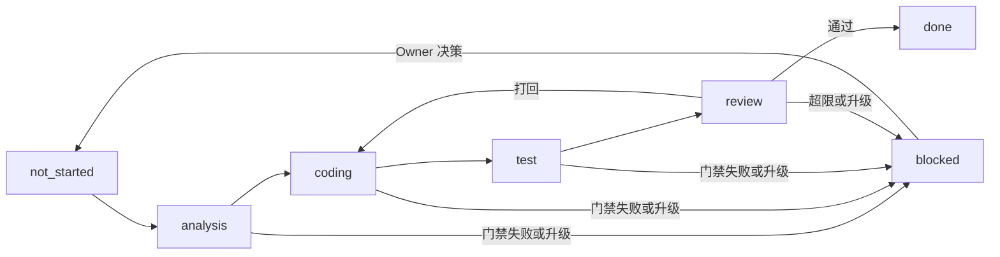

# Agent 设计计划：Codex 桌面版可执行多智能体流水线 v2

> 状态：已完成（F-008 已落地）
> 目标 Feature：F-008（已登记）
> 参考：`Lawofall/AgentCore` 的编排器、执行引擎、检查点、协作模式设计；只借鉴概念，不引入 AgentCore 代码或运行时。

## 1. 目标

把当前“角色文档 + 串行提示词”的桌面版流水线，升级为“可校验的流水线契约 + 状态机 + 交接协议 + 门禁/重试/升级语义 + 可观测记录”。

约束：

- 不重建 CLI，不引入新依赖。
- 不接入 AgentCore 平台，不把公司项目数据迁到第三方工作台。
- 编排继续由 Codex 桌面版多智能体完成，脚本只负责校验、门禁和 Git/PR。

## 2. 当前基线

已存在：

- `.harness/agents/pipeline/`：协调者 + 分析/编码/测试/评审 5 个角色契约。
- `.harness/pipelines/desktop-coordinator.md`：桌面版流程提示词。
- `.harness/state/`：状态目录说明。
- `script/harness-git.ps1`：commit/push/pr 自动化。
- `feature-list.json`：已有 `pipeline` 字段。

主要缺口：

- 没有统一的流水线状态 JSON schema。
- 没有阶段交接物协议，下一阶段“该拿到什么”不明确。
- 门禁、重试、升级、打回规则分散在提示词里，无法被脚本校验。
- 没有 DAG 配置，未来想并行无法平滑扩展。
- 可观测性只有日志，缺少 Journal 和最终报告的数据来源。

## 3. 借鉴 AgentCore 后的设计原则

| AgentCore 概念 | 本项目落法 |
| --- | --- |
| CEO 唯一声音 | 协调者只做监督、门禁、汇报，不写业务代码 |
| `delegate` + `depends_on` | 流水线配置用 `stages.depends_on` 表达依赖；v1 串行，字段为并行预留 |
| 波边界检查点 | 每阶段结束由协调者跑门禁；评审打回等于 `replan` 回编码阶段 |
| `escalate` | 交接物增加 `escalations`；`blocking=true` 时停止并问 Owner |
| Turn / Journal / Run | 状态 JSON 作为 Journal，每个阶段一次 Run 记录 |
| 产物注入，不 worker 直聊 | 上游 handoff 和 artifacts 作为下一阶段输入，阶段 Agent 不直接沟通 |
| 权限轴 | 按角色定义写权矩阵，Git 只走 `script/harness-git.ps1` |

## 4. 核心模型

### 4.1 流水线定义

新增 `.harness/pipelines/desktop-pipeline.json`：

```json
{
  "schema_version": "1.0",
  "pipeline": "desktop",
  "stages": [
    {
      "id": "analysis",
      "role": "analyst",
      "depends_on": [],
      "gate": "script/check.ps1",
      "max_attempts": 1,
      "outputs": ["analysis_scope"]
    },
    {
      "id": "coding",
      "role": "coder",
      "depends_on": ["analysis"],
      "gate": "script/check.ps1 -Compile",
      "max_attempts": 2,
      "outputs": ["code_changes"]
    },
    {
      "id": "test",
      "role": "tester",
      "depends_on": ["coding"],
      "gate": "script/check.ps1 -Backend",
      "max_attempts": 2,
      "outputs": ["test_report"]
    },
    {
      "id": "review",
      "role": "reviewer",
      "depends_on": ["test"],
      "gate": "script/check.ps1",
      "max_attempts": 1,
      "max_rework": 2,
      "outputs": ["review_verdict"]
    }
  ]
}
```

协调者可按实际影响面选择更轻的门禁，但必须在 journal 中记录原因。

### 4.2 状态文件 schema

状态文件：`.harness/state/pipeline-desktop-<feature>.json`

```json
{
  "schema_version": "1.0",
  "feature_id": "F-001",
  "status": "running",
  "current_stage": "coding",
  "stages": [
    {
      "id": "analysis",
      "status": "passed",
      "attempts": 1,
      "max_attempts": 1,
      "depends_on": [],
      "gate": "script/check.ps1",
      "started_at": "2026-08-07T10:00:00+08:00",
      "finished_at": "2026-08-07T10:05:00+08:00",
      "handoff": ".harness/state/tasks/F-001-analysis.md",
      "artifacts": [],
      "last_error": null
    }
  ],
  "journal": [
    {
      "seq": 1,
      "at": "2026-08-07T10:00:00+08:00",
      "type": "stage_started",
      "stage": "analysis",
      "note": "启动需求分析"
    }
  ],
  "created_at": "2026-08-07T10:00:00+08:00",
  "updated_at": "2026-08-07T10:05:00+08:00"
}
```

状态取值：

- 流水线：`not_started` / `running` / `blocked` / `done`
- 阶段：`queued` / `running` / `passed` / `failed` / `skipped`
- 阶段重试：`attempts < max_attempts` 时可重试；达到上限仍未过门禁则 `blocked`
- 评审打回：`review.max_rework` 上限为 2，超限后 `blocked` 并升级 Owner

### 4.3 阶段交接物

新增 `.harness/templates/pipeline-handoff.md.template`，固定字段：

```text
stage
feature_id
conclusion: passed | needs_owner
scope_covered
files_changed
artifacts
evidence: 命令、退出码、关键输出
decisions
risks
escalations: [{ kind: normal|scope|dep, blocking: true|false, question, default_if_ignored }]
next_stage_contract: 下一阶段必须收到的输入
```

协调者校验规则：

- 文件不存在、`conclusion` 非法、必需字段缺失 → 阶段硬失败，可重试。
- 存在 `blocking=true` 的 escalation → 停止流水线，标记 `blocked`，问 Owner。
- `kind=scope` / `dep` 且非阻塞 → 记入 journal，按 `default_if_ignored` 继续并告知下一阶段。

## 5. 执行流程与状态机



协调者执行规则：

1. 启动前读取 feature plan、pipeline 配置、当前状态；状态缺失则按 schema 初始化。
2. 按 `depends_on` 推进阶段；v1 只有串行依赖，不启动并行。
3. 每阶段创建任务卡，读取对应角色契约，交给阶段 Agent 执行。
4. 阶段 Agent 只写自己的交付物，不允许 worker 之间直接沟通。
5. 阶段完成后校验 handoff，运行门禁，追加 journal。
6. 门禁失败：记录退出码，重试；达到上限后 `blocked` 并升级。
7. 评审打回：把 reviewer 问题清单作为 `rework_scope` 交给 coder，重新走 coding -> test -> review。
8. 全部通过：生成最终报告，feature-list 置 `ready_for_review`，等待 Git/PR 收尾。

## 6. 角色权限矩阵

| 角色 | 可写 | 不可写 |
| --- | --- | --- |
| 协调者 | state、日志、报告、feature-list | 业务代码、SQL、配置、git push |
| 分析 Agent | 分析 handoff、scope 清单 | 业务代码、SQL、配置、测试 |
| 编码 Agent | scope 内业务代码、SQL、配置、测试 | scope 外文件、state、日志、git push |
| 测试 Agent | 测试文件、测试记录 | 业务逻辑、SQL、配置 |
| 评审 Agent | 评审报告 | 业务代码、测试、state |
| Git/PR | 仅 `script/harness-git.ps1`，且用户确认后 | 自动 push、force push |

## 7. 可观测性

- `pipeline-desktop-<feature>.json`：运行期唯一事实源，追加式 Journal。
- `.harness/state/logs/<feature>-<stage>.log`：阶段日志和门禁输出。
- `.harness/state/tasks/<feature>-<stage>.md`：阶段交接物。
- `.harness/state/reports/pipeline-desktop-<feature>.md`：最终报告。
- `feature-list.json`：对外状态、history、Git 字段。

报告模板升级为：阶段表、每阶段证据、关键决策、风险、遗留项。

## 8. Git/PR 收尾

- 流水线 `done` 后，feature-list 状态为 `ready_for_review`，不自动 push。
- 用户确认后执行：`harness commit -Feature F-00X`、`harness push -Feature F-00X`、`harness pr -Feature F-00X`。
- commit/push/pr 结果回写 feature-list，遵守 `.harness/rules/git-workflow.md`。

## 9. 落地文件清单

新增：

- `.harness/pipelines/desktop-pipeline.json`
- `.harness/templates/pipeline-handoff.md.template`
- `.harness/templates/pipeline-state.example.json`

修改：

- `.harness/agents/pipeline/README.md`、`coordinator.md`、`analyst.md`、`coder.md`、`tester.md`、`reviewer.md`
- `.harness/pipelines/desktop-coordinator.md`
- `.harness/templates/pipeline-task-card.md.template`、`pipeline-report.md.template`
- `.harness/state/README.md`
- `script/harness-check.ps1`
- `AGENTS.d/00-common.md`
- `.harness/README.md`
- `.harness/PROGRESS.md`
- `.harness/changes/active/feature-list.json`（登记 F-008）

## 10. 执行步骤

1. 创建 `desktop-pipeline.json`，定义 4 阶段、依赖、门禁、重试上限。
2. 创建状态 example 和 handoff 模板，更新 state README 为 schema 说明。
3. 重写协调者流程和 5 个角色契约，加入 handoff、escalation、重试、打回语义。
4. 更新任务卡和报告模板。
5. 扩展 `harness-check.ps1`：校验 pipeline 配置、state schema、handoff 模板存在。
6. 更新 `AGENTS.d/00-common.md` 按需读取判定表，登记 pipeline 角色和配置。
7. 更新 `.harness/README.md` 知识坐标。
8. 在 `feature-list.json` 登记 F-008，更新 PROGRESS。
9. 执行验证：JSON 解析、PowerShell 语法、`script/check.ps1`、`script/sync-changes.ps1`、`git diff --check`。
10. 创建提交（不自动 push），更新 completed 记录和 INDEX。

## 11. 验收标准

- `desktop-pipeline.json` 和 `pipeline-state.example.json` 可被 `ConvertFrom-Json` 解析。
- `harness-check.ps1` 语法 0 error，且能识别缺失的 pipeline 配置、非法 stage 依赖、非法 state schema。
- `script/check.ps1` 0 error。
- `script/sync-changes.ps1` 0 error。
- 角色契约、协调者流程、handoff 模板、state README 字段一致。
- 所有 live 路径不再引用已退役的 harness-cli 运行器。
- F-008 已登记，PROGRESS 已更新，提交已创建且未 push。

## 12. 明确不做

- 不接入 AgentCore 代码或平台。
- 不重建 CLI，不新增可执行编排器。
- v1 不实现并行 DAG，只保留 `depends_on` 字段。
- 不自动执行 git push。
- 不引入新依赖，不启动 Docker/Postgres/Redis。
- 不把 `.harness/state/` 运行产物纳入 Git 跟踪。
