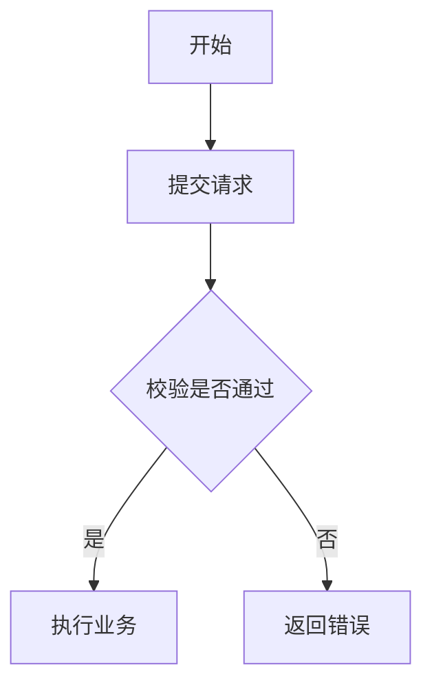
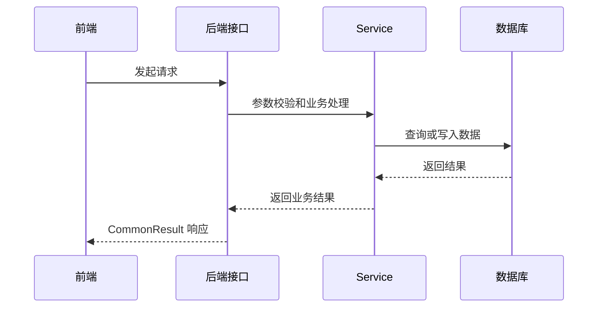
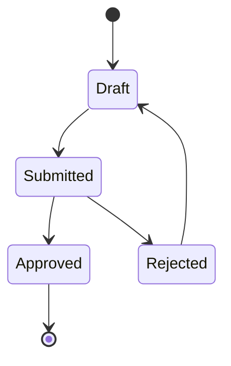

# .harness/rules/documentation-change-rule.md

## 1. 文件定位

本文件定义示例后端后端项目在需求变更、Bug 修复、功能迭代、复杂逻辑开发时的文档同步规则。

目标是保证前后端分离开发中，前端、后端、测试、运维和智能体都能快速理解接口、流程、边界、风险和历史变更。

## 2. 文档类型

| 文档类型 | 落点 | 用途 |
| --- | --- | --- |
| 前端对接说明 | `.harness/wiki/frontend-integration.md` | 给前端快速开发、联调和排查问题使用 |
| API 协议说明 | `.harness/wiki/api-contract.md` | 记录通用接口协议、Content-Type、响应结构、错误码 |
| 功能设计说明 | `.harness/wiki/feature-design/<中文业务名>设计说明.md` | 记录复杂业务逻辑、流程图、时序图、状态流和边界条件 |
| 详细落地方案 | `.harness/wiki/feature-design/<中文业务名>实施方案.md` | 记录 L3/L4 需求的模块拆分、表结构、接口边界、实施顺序、验证和风险控制 |
| 数据模型说明 | `.harness/wiki/data-model.md` | 记录核心表、字段、初始化数据、表关系和数据流 |
| 执行计划 | `.harness/changes/active/<中文任务名>执行计划.md` | 记录本次需求、Bug、重构或迁移的实施计划 |
| 完成记录 | `.harness/changes/completed/<中文任务名>完成记录.md` | 记录本次变更结果、验证结果、遗留风险和后续行动 |
| 需求完成跟踪 | `.harness/changes/completed/<中文业务名>需求完成跟踪.md` | L3 / L4、多阶段、权限安全、跨服务或前后端协作需求完成后持续维护完成矩阵、交付范围、验证结果、设计口径和后续行动 |

## 3. 复杂度分级

| 级别 | 判定标准 | 文档要求 |
| --- | --- | --- |
| L1 简单 | 单接口小改、字段展示、小 Bug 修复，无流程变化 | 在执行计划或交付说明中记录即可 |
| L2 中等 | 新增接口、修改请求或响应、涉及前后端联调 | 必须更新 `frontend-integration.md` 或 `api-contract.md` |
| L3 复杂 | 涉及多接口、多状态、多角色、多表、权限、异步流程 | 必须新增或更新功能设计说明；多阶段落地时必须补详细落地方案 |
| L4 高风险 | 涉及登录、OAuth2、Token、权限、租户、数据修复、跨模块改造 | 必须有设计说明、详细落地方案、流程图或时序图、风险说明和 Owner 确认 |

复杂度按最高风险项判定。一个需求只要命中 L4 条件，即使代码改动较小，也按 L4 管理。

## 4. 文档更新触发规则

以下情况必须检查文档是否需要更新：

- 新增接口；
- 修改接口路径、Method、Content-Type；
- 修改请求参数、响应字段、错误码；
- 新增或修改前端可见枚举字段，包括状态、类型、来源、审核结果、访问结果、事件类型、资源类型、脱敏方式等；
- 修改登录、认证、授权、OAuth2、Token、租户逻辑；
- 修改业务流程、状态机、审批流；
- 新增或修改数据库表结构；
- Bug 修复改变了原有接口行为；
- 功能迭代叠加到已有业务流程；
- 前端联调中发现原文档与实际行为不一致；
- 测试、运维或智能体无法仅通过现有文档理解功能边界。
- 发现需求理解错误、方案设计偏离需求文档或当前实现与需求验收目标不一致。

涉及需求理解错误或方案纠偏时，必须同步执行 `.harness/rules/requirement-alignment-rule.md`，并在对应设计说明或执行计划中记录“纠偏原因、需求依据、旧方案问题、新方案边界、复用策略”。

## 5. 复杂功能设计说明要求

L3 / L4 功能必须补充功能设计说明，至少包含：

- 背景和目标；
- 非目标；
- 业务流程；
- 角色和权限；
- 核心接口清单；
- 数据模型影响；
- 状态变化；
- 异常和边界场景；
- 前后端交互说明；
- 测试关注点；
- Mermaid 流程图；
- Mermaid 时序图，必要时补充状态图。

如果 L3 / L4 功能需要拆分多个开发阶段，或涉及新增模块、SQL、接口边界、跨服务协作，则必须额外补充详细落地方案，至少包含：

- 复杂度评级；
- 模块落地方案；
- 分阶段落地方案；
- 数据表和字段注释要求；
- 接口开放前置条件；
- 验证方案；
- 风险和控制；
- 当前实施状态；
- 后续编码前置要求。

## 6. Mermaid 图要求

复杂流程必须优先使用 Mermaid，避免只用文字描述。

流程图用于说明业务阶段、条件分支和异常出口：

时序图用于说明前端、后端、第三方系统、数据库之间的调用关系：

状态复杂时补充状态图：

## 7. 文档更新原则

- 文档必须跟随代码一起更新，不能等到功能完成后再凭记忆补。
- Bug 修复如果改变接口行为，也视为接口变更。
- 功能迭代如果叠加到旧流程，必须说明新增逻辑如何影响旧逻辑。
- 前端对接说明只写前端需要知道的信息，不堆叠后端内部实现细节。
- 前端对接说明必须显式定义前端会传入、展示、筛选或统计的枚举字段，不允许只写“以后端枚举为准”而缺少具体取值。
- 设计说明要解释为什么这样设计，不只是罗列接口。
- 已废弃接口、字段、流程必须明确标注废弃原因和替代方案。
- 文档和代码事实不一致时，以代码为准，但必须同步修正文档。

## 8. Harness 文档迭代规则

### 8.1 文档不是一次性产物

以下文档必须随着代码和业务迭代同步演进：

- `AGENTS.md`
- `ARCHITECTURE.md`
- `.harness/rules/*`
- `.harness/wiki/*`
- `.harness/changes/*`

### 8.2 触发更新条件

以下情况必须检查 Harness 文档是否需要更新：

- 启用模块变化；
- 服务装配变化；
- 业务域边界变化；
- 接口协议变化；
- 前端对接方式变化；
- SQL 结构或初始化数据变化；
- 复杂流程变化；
- 审批边界变化；
- 技术债状态变化；
- 迁移方案变化。

### 8.3 更新原则

- 长期事实写入 `wiki/`；
- 长期规则写入 `rules/`；
- 一次性计划写入 `changes/active/`；
- 完成结果写入 `changes/completed/`；
- L3 / L4、多阶段、权限安全、跨服务或前后端协作需求完成后，必须在 `changes/completed/` 新增或维护需求完成跟踪文档；
- 不把一次性排查过程写进 `AGENTS.md` 或 `ARCHITECTURE.md`。
- Harness 自身不新增 `*-spec.md` 草稿；V1 草稿只读归档到 `.harness/archive/v1-specs/`。
- 长周期需求跟踪文档只保留状态摘要和历史索引，按日期拆分的完整记录写入 `changes/completed/archive/`。
- 新增 L3 / L4 功能设计、实施方案、执行计划、完成记录和需求完成跟踪文档时，文件名应优先使用中文业务名，并带明确文档类型后缀；历史英文文件名应在触达维护时逐步改为中文名并同步索引。

### 8.4 版本叠加要求

功能迭代叠加旧逻辑时，文档必须明确：

- 新逻辑是什么；
- 旧逻辑是否保留；
- 兼容边界是什么；
- 哪些调用方会受影响；
- 哪些图和说明需要更新。

## 9. 交付检查清单

每次需求、Bug 修复或功能迭代交付前，必须检查：

- 是否涉及接口变化；
- 新增或调整的接口是否重新审视过业务操作逻辑，不能只验证代码可编译、测试可通过；
- 接口是否支撑前端真实页面操作闭环，包括新增、编辑、回显、查询、筛选、批量操作、启停、删除、状态流转和异常提示；
- 接口命名、路径、权限标识和菜单语义是否一致，避免同一业务动作出现多套命名或旧路径继续作为新页面主链路；
- 接口对应的数据表职责是否单一，运行态查询是否能唯一定位业务上下文；
- 是否涉及前端联调方式变化；
- 是否涉及请求、响应、错误码变化；
- 是否涉及前端可见枚举变化，且已在前端对接文档列出字段名、取值、文案、使用场景、统计口径和未知值兜底方式；
- 是否涉及表结构、初始化数据或数据流变化；
- 是否达到 L3 / L4 复杂度；
- 是否需要新增或更新功能设计说明；
- 是否需要更新执行计划或完成记录；
- 是否存在文档与实际代码不一致。

## 9.1 接口业务逻辑复核要求

新增或调整接口时，交付前必须在对应执行计划、设计说明或完成跟踪文档中补充“接口业务逻辑复核”结论。复核至少覆盖：

- 页面入口：该接口属于哪个菜单或页面，是否存在前端真实使用场景；
- 操作顺序：前端是否能按业务顺序完成主数据维护、关系绑定、策略配置和运行态验证；
- 读写闭环：创建或更新后是否有详情、分页或树接口支持回显和继续编辑；
- 批量能力：需求要求批量操作时，接口是否支持批量传参、部分失败策略或明确整体失败；
- 权限边界：接口是否区分管理平台、组织管理员自服务、业务系统运行态集成，不得混用；
- 数据边界：接口是否只写入本业务域表，不跨模块直接改写无关主数据；
- 运行态唯一性：业务系统或 SDK 是否能通过稳定字段唯一定位上下文，不能依赖前端猜测；
- 兼容策略：旧接口如果保留，必须说明是否仅兼容历史调用，新管理页面是否允许继续依赖；
- 文档同步：接口路径、请求字段、响应字段、枚举、错误码和页面交互必须同步到 Harness 文档。

如果复核发现“接口虽然存在，但不能支撑页面业务逻辑”，必须先调整接口设计或补充接口，再进入完成验收。

## 10. 前端对接文档枚举定义规范

凡是接口请求、响应、查询条件、列表筛选、表单选项、状态流转、统计口径或审计展示中出现枚举字段，前端对接文档必须补充枚举定义。

枚举定义至少包含：

- 字段名，例如 `status`、`reviewResult`、`accessResult`；
- Java 枚举类名或后端事实来源，例如 `PlatformSubscriptionStatusEnum`；
- 完整取值和中文文案；
- 前端展示、筛选、表单传值或统计口径；
- 哪些接口允许前端传该值，哪些值只能由后端写入；
- 未知值兜底展示方式，默认使用 `未知(<原值>)`；
- 如枚举值影响状态流转，必须说明允许的流转动作。

禁止事项：

- 禁止只写“按后端枚举处理”但不列出具体值；
- 禁止前端临时自定义枚举文案后不回写 Harness 文档；
- 禁止不同文档对同一枚举使用不同中文含义；
- 禁止把同一字段在列表、表单、运营总览、审计详情中写成不同统计口径。
